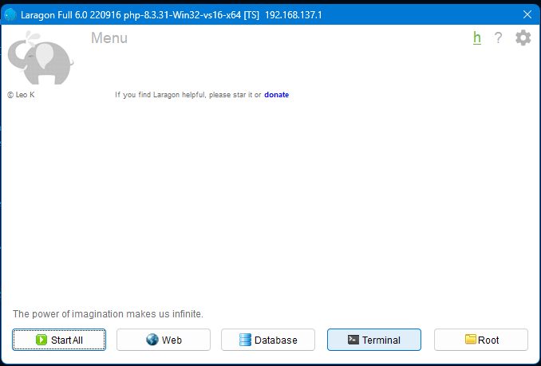
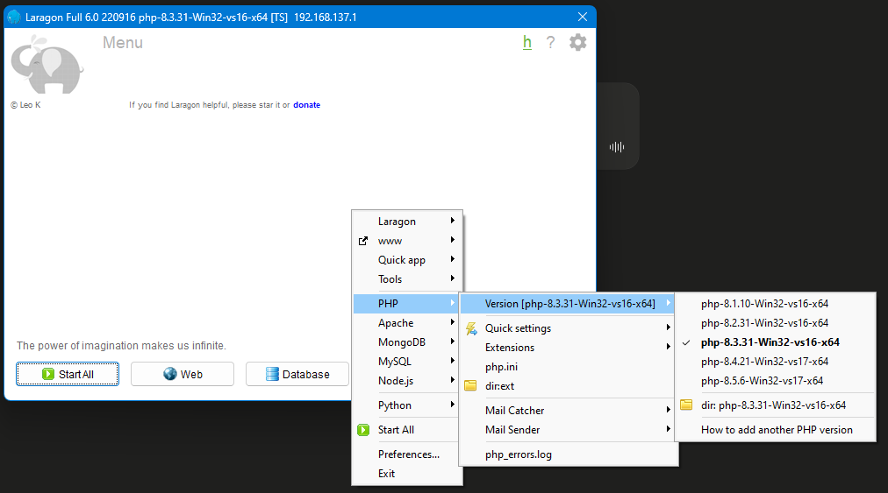
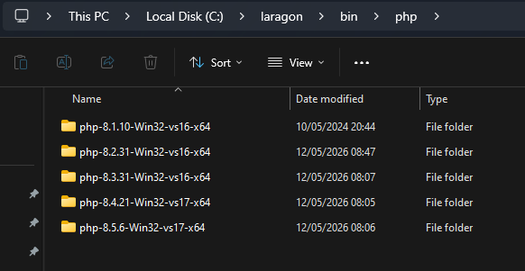
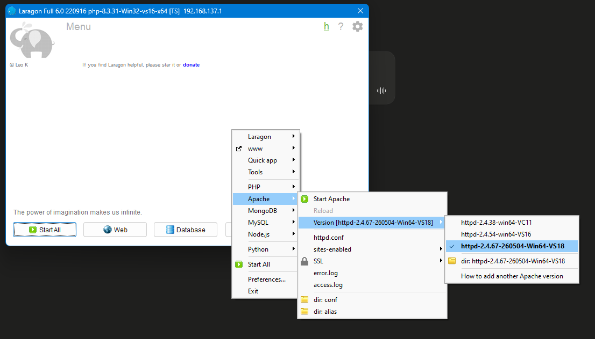
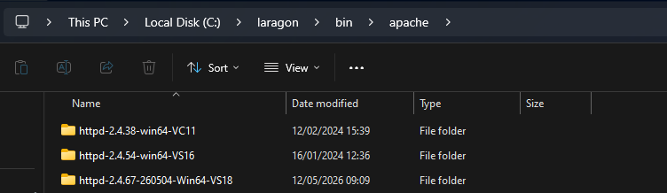
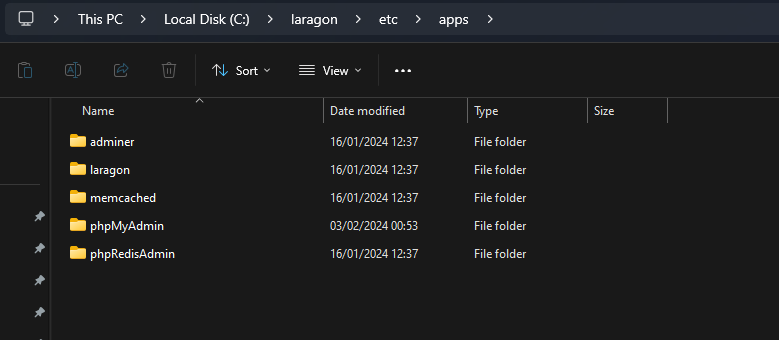

# 🚀 Tutorial Instalasi Laragon v6 untuk Laravel 13

Panduan lengkap instalasi **Laragon v6** beserta konfigurasi PHP, Apache, MySQL, dan environment yang dibutuhkan untuk menjalankan project **Laravel 13**. Tutorial ini mencakup instalasi untuk **Windows** dan **macOS**.

---

## 📋 Daftar Isi

- [Persyaratan Sistem](#-persyaratan-sistem)
- [Instalasi di Windows](#-instalasi-di-windows)
- [Instalasi di macOS](#-instalasi-di-macos)
- [Konfigurasi PHP](#-konfigurasi-php)
- [Konfigurasi Apache](#-konfigurasi-apache)
- [Setup Database (MySQL)](#-setup-database-mysql)
- [Instalasi Project Laravel 13](#-instalasi-project-laravel-13)
- [Konfigurasi Environment (.env)](#-konfigurasi-environment-env)
- [Troubleshooting](#-troubleshooting)
- [Tools Tambahan](#-tools-tambahan)

---

## 💻 Persyaratan Sistem

| Komponen | Versi Minimum | Rekomendasi |
|----------|---------------|-------------|
| PHP | 8.2 | 8.3.31 / 8.4.21 |
| Composer | 2.x | Terbaru |
| Apache | 2.4.38 | 2.4.67 |
| MySQL/MariaDB | 5.7+ | 8.0+ |
| Node.js (untuk Vite) | 18.x | 20.x LTS |
| RAM | 4 GB | 8 GB+ |
| OS | Windows 10/11, macOS 12+ | - |

> ⚠️ **Catatan:** Laravel 13 membutuhkan minimal **PHP 8.2**. Disarankan menggunakan PHP 8.3 atau 8.4 untuk performa terbaik.

---

## 🪟 Instalasi di Windows

### 1. Download Laragon v6

Download installer Laragon v6 melalui link berikut:

👉 [**Download Laragon v6 (Full)**](https://github.com/sindelarastechnology/Laragon-6.0.0-Untuk-Laravel-13/releases/download/Assets/laragon-wamp.exe)

### 2. Install Laragon

1. Jalankan file `laragon-wamp.exe` yang sudah diunduh.
2. Pilih lokasi instalasi (default: `C:\laragon`).
3. Tunggu proses instalasi selesai, lalu jalankan Laragon.

### 3. Tampilan Awal Laragon

Setelah dibuka, Laragon akan menampilkan menu utama seperti berikut:

```
[SCREENSHOT: Tampilan utama Laragon dengan tombol Start All, Web, Database]
```

> 

---

## 🍎 Instalasi di macOS

Laragon **tidak tersedia secara native untuk macOS**, namun kamu bisa menjalankan environment serupa menggunakan beberapa alternatif berikut:

### Opsi 1: Menggunakan Laravel Herd (Rekomendasi)

[Laravel Herd](https://herd.laravel.com/) adalah environment development resmi dari komunitas Laravel untuk macOS, mirip dengan Laragon.

1. Download Laravel Herd dari [herd.laravel.com](https://herd.laravel.com/)
2. Install file `.dmg` yang sudah diunduh
3. Buka aplikasi Herd, ia akan otomatis menginstall PHP, Nginx, dan dnsmasq
4. Tambahkan versi PHP tambahan jika diperlukan melalui menu **Herd > PHP**

### Opsi 2: Menggunakan Homebrew + Manual Setup

```bash
# Install Homebrew (jika belum ada)
/bin/bash -c "$(curl -fsSL https://raw.githubusercontent.com/Homebrew/install/HEAD/install.sh)"

# Install PHP 8.3
brew install php@8.3

# Install Composer
brew install composer

# Install MySQL
brew install mysql
brew services start mysql

# Install Node.js
brew install node
```

### Opsi 3: Menggunakan Docker (Laravel Sail)

Jika project Laravel kamu sudah menyertakan Sail:

```bash
./vendor/bin/sail up -d
```

> 💡 Untuk konsistensi tim (Windows + Mac), disarankan menggunakan **Laravel Sail (Docker)** agar environment seragam di semua OS.

---

## 🐘 Konfigurasi PHP

### Mengubah Versi PHP di Laragon (Windows)

Laragon v6 mendukung multi-version PHP. Berikut cara menggantinya:

1. Klik kanan pada area Laragon → **PHP** → **Version**
2. Pilih versi PHP yang diinginkan (contoh: `php-8.3.31-Win32-vs16-x64`)

```
[SCREENSHOT: Menu klik kanan Laragon > PHP > Version, menampilkan pilihan versi PHP]
```

> 

### Menambahkan Versi PHP Baru (Manual)

Jika versi PHP yang dibutuhkan belum tersedia, kamu bisa menambahkannya secara manual:

1. Download package PHP versi yang diinginkan dari [windows.php.net/download](https://windows.php.net/download/)
2. Extract folder hasil download ke:
   ```
   C:\laragon\bin\php\
   ```
3. Pastikan struktur folder sesuai format, contoh:
   ```
   C:\laragon\bin\php\php-8.4.21-Win32-vs17-x64\
   C:\laragon\bin\php\php-8.5.6-Win32-vs17-x64\
   ```
4. Restart Laragon, lalu pilih versi PHP baru melalui menu **PHP > Version**

```
[SCREENSHOT: Folder C:\laragon\bin\php berisi beberapa versi PHP]
```

> 

### Mengaktifkan Ekstensi PHP

Beberapa ekstensi PHP yang **wajib aktif** untuk Laravel 13:

```ini
extension=bcmath
extension=ctype
extension=curl
extension=dom
extension=fileinfo
extension=filter
extension=hash
extension=mbstring
extension=openssl
extension=pcre
extension=pdo
extension=pdo_mysql
extension=session
extension=tokenizer
extension=xml
extension=zip
extension=gd
extension=intl
```

Cara mengaktifkan: klik kanan Laragon → **PHP** → **Extensions**, lalu centang ekstensi di atas. Atau edit langsung file `php.ini`:

```
C:\laragon\bin\php\php-8.3.31-Win32-vs16-x64\php.ini
```

Hapus tanda `;` di depan baris ekstensi yang dibutuhkan.

---

## 🌐 Konfigurasi Apache

### Mengubah Versi Apache

1. Klik kanan Laragon → **Apache** → **Version**
2. Pilih versi Apache yang diinginkan (contoh: `httpd-2.4.67-260504-Win64-VS18`)

```
[SCREENSHOT: Menu klik kanan Laragon > Apache > Version, menampilkan pilihan versi Apache]
```

> 

### Menambahkan Versi Apache Baru (Manual)

1. Download Apache (Win64) dari [apachelounge.com/download](https://www.apachelounge.com/download/)
2. Extract ke folder:
   ```
   C:\laragon\bin\apache\
   ```
3. Pastikan struktur folder seperti:
   ```
   C:\laragon\bin\apache\httpd-2.4.67-260504-Win64-VS18\
   ```
4. Restart Laragon dan pilih versi Apache baru.

```
[SCREENSHOT: Folder C:\laragon\bin\apache berisi beberapa versi Apache]
```

> 

### Virtual Host Otomatis

Laragon secara otomatis membuat virtual host untuk setiap folder project di dalam `C:\laragon\www\`. Misalnya, project bernama `bracket-app` akan otomatis dapat diakses melalui:

```
http://bracket-app.test
```

---

## 🗄️ Setup Database (MySQL)

### 1. Start Database melalui Laragon

Klik tombol **Start All** atau **Database** pada panel Laragon untuk menjalankan MySQL.

### 2. Akses phpMyAdmin

Laragon menyertakan phpMyAdmin di dalam folder:

```
C:\laragon\etc\apps\phpMyAdmin\
```

Akses melalui browser:

```
http://localhost/phpmyadmin
```

```
[SCREENSHOT: Folder C:\laragon\etc\apps berisi adminer, phpMyAdmin, dll]
```

> 

### 3. Membuat Database Baru

1. Login ke phpMyAdmin (default user: `root`, password: kosong)
2. Klik **New** → masukkan nama database, contoh: `bracket_tournament`
3. Pilih collation `utf8mb4_unicode_ci`
4. Klik **Create**

---

## ⚡ Instalasi Project Laravel 13

### 1. Pindahkan/Clone Project ke Folder www

```bash
cd C:\laragon\www
git clone https://github.com/username/nama-project.git
cd nama-project
```

### 2. Install Dependencies via Composer

```bash
composer install
```

### 3. Install Dependencies Frontend (NPM)

```bash
npm install
npm run build
```

> Untuk development dengan hot reload (Vite):
> ```bash
> npm run dev
> ```

### 4. Generate Application Key

```bash
cp .env.example .env
php artisan key:generate
```

### 5. Jalankan Migration

```bash
php artisan migrate
```

Atau dengan seeder:

```bash
php artisan migrate --seed
```

### 6. Akses Project

Karena Laragon membuat virtual host otomatis, akses project melalui:

```
http://nama-project.test
```

Atau jalankan server bawaan Laravel:

```bash
php artisan serve
```

Lalu akses melalui:

```
http://127.0.0.1:8000
```

---

## ⚙️ Konfigurasi Environment (.env)

Berikut contoh konfigurasi `.env` yang umum digunakan untuk development lokal dengan Laragon:

```env
APP_NAME="Tournament Bracket"
APP_ENV=local
APP_KEY=base64:xxxxxxxxxxxxxxxxxxxxxxxxxxxxxxxxxxxxxxxxxxx
APP_DEBUG=true
APP_URL=http://nama-project.test

LOG_CHANNEL=stack
LOG_LEVEL=debug

DB_CONNECTION=mysql
DB_HOST=127.0.0.1
DB_PORT=3306
DB_DATABASE=bracket_tournament
DB_USERNAME=root
DB_PASSWORD=

SESSION_DRIVER=database
SESSION_LIFETIME=120

CACHE_STORE=database
QUEUE_CONNECTION=database

MAIL_MAILER=log
```

### Untuk macOS (Herd / Homebrew)

```env
APP_URL=http://nama-project.test
DB_HOST=127.0.0.1
DB_PORT=3306
DB_USERNAME=root
DB_PASSWORD=password
```

> 💡 Pada macOS dengan Homebrew, password default MySQL biasanya kosong saat instalasi pertama. Set password melalui:
> ```bash
> mysql_secure_installation
> ```

---

## 🔧 Troubleshooting

| Masalah | Solusi |
|---------|--------|
| `Class "PDO" not found` | Aktifkan ekstensi `pdo_mysql` di `php.ini` |
| Port 80/443 sudah digunakan | Matikan Skype/IIS atau ubah port Apache via Laragon Preferences |
| `npm run dev` error CORS | Tambahkan domain `.test` di `vite.config.js` pada bagian `server.cors` |
| Virtual host `.test` tidak terbaca | Pastikan Laragon berjalan sebagai Administrator agar bisa edit `hosts` file |
| `Mcrypt`/`GD` extension error | Aktifkan ekstensi terkait melalui menu PHP > Extensions |
| Permission error di macOS | Jalankan `chmod -R 775 storage bootstrap/cache` |

---

## 🛠️ Tools Tambahan

Folder `etc/apps` pada Laragon berisi beberapa tools bawaan yang berguna:

| Tools | Fungsi |
|-------|--------|
| **Adminer** | Alternatif ringan untuk manajemen database |
| **phpMyAdmin** | GUI untuk manajemen database MySQL |
| **phpRedisAdmin** | GUI untuk manajemen Redis |
| **Memcached** | Caching server |


---

## 📦 Asset Tambahan (PHP & Apache Build)

Repository ini menyertakan build PHP dan Apache versi terbaru yang sudah disiapkan dan siap pakai:

- ✅ PHP 8.1.10 - Win32-vs16-x64
- ✅ PHP 8.2.31 - Win32-vs16-x64
- ✅ PHP 8.3.31 - Win32-vs16-x64
- ✅ PHP 8.4.21 - Win32-vs17-x64
- ✅ PHP 8.5.6 - Win32-vs17-x64
- ✅ Apache httpd-2.4.38 - Win64-VC11
- ✅ Apache httpd-2.4.54 - Win64-VS16
- ✅ Apache httpd-2.4.67 - Win64-VS18

Cara penggunaan:
1. Download folder versi yang dibutuhkan dari [Releases](#) repository ini
2. Extract ke `C:\laragon\bin\php\` atau `C:\laragon\bin\apache\` sesuai jenisnya
3. Restart Laragon dan pilih versi melalui menu klik kanan

---

## 🤝 Kontribusi

Jika menemukan masalah atau ingin menambahkan tutorial, silakan buat **Issue** atau **Pull Request**.

---

## 📄 Lisensi

Project ini dibuat untuk tujuan edukasi dan dokumentasi pribadi. Laragon dan Laravel memiliki lisensi masing-masing sesuai pengembang aslinya.
